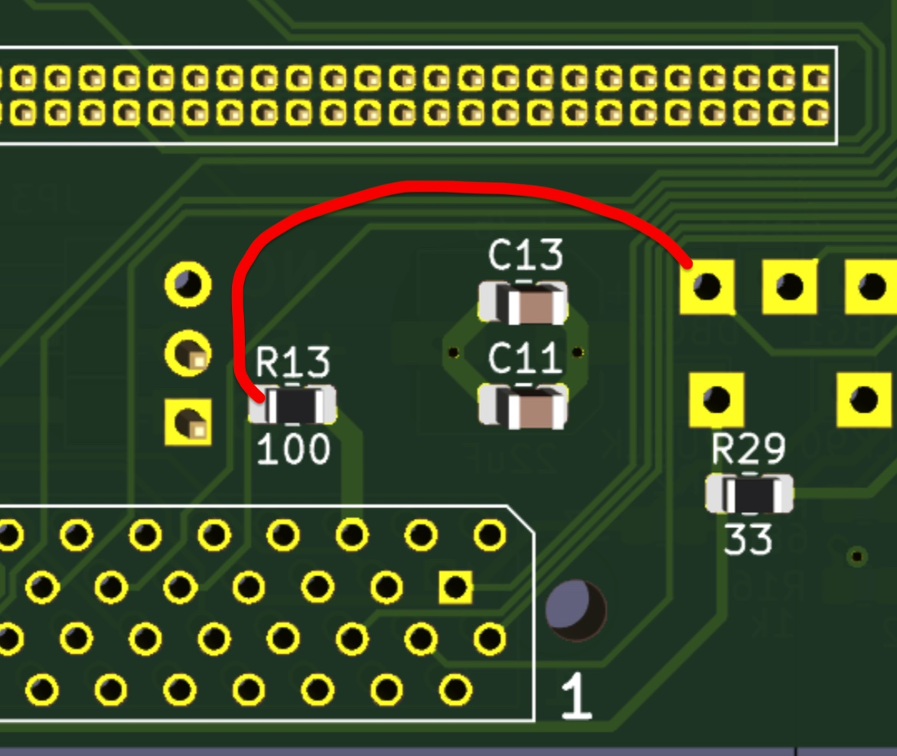

# Z3660 Changes

## v1.01
 * First public version

## v1.02
 * SCSI SD emulation first steps.
 * The CPLD firmware doesn't implement DMA accesses, so you can't use busmaster Zorro III boards (like the A4091).
Also A4000T and A3000(T) will not work with any SCSI attached unit.
<br>A4000T can boot, but not use the internal SCSI, if you use the A4000D kickstart.

## v1.03 beta 1
 * Fixed some troubles with 8 bit modes and miniterm 12 (copy_rect_nomask).
 * Added pre-alfa version of warp3d.library. There is too much work to be done here... but... I want to show you this... Warning: the addresses are hardcoded and you will need to have Z3 RAM enabled (autoconfigured RTG has to be at $50000000)!!!!
 * I2C measures are now controlled by a state machine. If I2C get stuck, then I2c measures are stopped (and don't affect to general behavior...).
 * Added new commands to console, so you can increment or decrement some "adjustment parameters" like EMU read/write delays, and ethernet nag delay.
 * ZTop app adjustments for different fonts. And now shows the Beta version.
 * As RTG driver has changed, you need to delete your devs:Picasso96Settings and start again with p96prefs... 
 * SCSI stability fixes<br>
 * The kickstart load has been changed in z3660cfg.txt. You firstly declare upto 9 different kickstarts, and finaly you select one of them using a index. Now you can change between kickstarts in Ztop application.
 * Also, it has been implemented the extended kistart load, in the same way than current kickstarts (they load at $00F00000).
 * The reset behavor has also changed:
<br> 1. If you maintain the reset for 4 seconds, then the CPU will cycle between 060, Musashi, UAE and UAEJIT. 
<br> 2. But if you maintain the reset for 8 seconds, then all env files will be deleted (the configuration used will be what you declared in z3660cfg.txt file as default).

## v1.03 beta 2
 * New config variable "enable_test". You can force a intensive test to CHIP RAM from ARM bus. This will be useful for testing purposes.
 * Update system. After turning on your Amiga, you can press 'C' in the Amiga keyboard to access to a BOOT.bin update system. It is not silly-proof, so don't expect now too much info for now. The sequence of keys you should press should be: 'C', 'I', 'U', 'R'. That is: enable 'C'onsole on HDMI, connect to 'I'nternet, 'U'pdate the Z3660.bin file, and finally 'R'eboot the system. Please wait until some message appears into the HDMI screen... It can take up to 20 seconds for some timeout (USB serial console shows more info).
Now BOOT.bin will search for the file Z3660.bin to boot from it (instead of BOOT.bin). If Z3660.bin is not correct, damaged or has something wrong, then BOOT.bin should continue to boot from itself. So, this should be somehow secure... but please take in mind that I have tried this only for two days...
For this you will need the new CPLD firmware, if you don't update it, then 060 will not boot because in the previous firmware the SNOOP signal was not activated when ARM makes bus accesses...
I think I haven't to say it but... obviously, you will need to connect an ethernet cable to the z-turn...
 * From serial console, you can select different phase for clocks. The setting can't be stored, this is only for my own tests.
 * Warp3D working in 060 and EMU, you will need the Wazp3D-Prefs and set Renderer to "Soft to Bitmap"

## v1.03 beta 3
 * SCSI SD emulation had two main issues.
<br> 1. The first one was that when copying a lot of data sometines the change between units was no applied, so the destination hdf had a bad write to a unknown block sector... this made the hdf corruption.
<br> 2. The second issue was a bug in the relocation of the filesystems. Even with the fixed code, I had a partition that was not working. When I debugged the problem I could see that the loaded filesystem had a bigger size than it should. It had in the hdf two repeated blocks. When I deleted the filesystem and back to write it (using FSUAE), then the problem went away. So be careful with the filesystems. Corrupted filesystems can't be repaired easily and posibly will make something wrong with the SD...
Finally, I have working and booting several hdf and partitions with PFS3
 * Warp3D should work now with and without Zorro3 RAM. It had some addreses hardcoded in beta 2, now all addresses are calculated in the system boot.
 * I have been working on the reset of 060 and ARM (I always reseted the ARM when Amiga was reseted, and this made that "Boot with no Startup-Sequence" didn't work). Now the reset of ARM is not attached to the reset of the Amiga, but sometimes the ARM doesn't reinit the Amiga autoconfig (that is done in FPGA when using the 060. EMU is not affected) so sometimes you will not see the SCSI, Z3 RAM and RTG boards... WIP...

## v1.03 beta 4
 * Ethernet driver got statistics and then apps like netmon now shows info about your network (thanks to @Stefan R )
 * New Boot screen showing a new logo, and info about version and options loaded. You need a new folder named images in exFAT partition.
 * RTG now has different MMU configurations in its different memory zones. So, the cache activity of the ARM RAM is not seen as RTG glitches, but without loosing the acceleration of the cache.
 
## v1.03 beta 5
 * Ethernet address can be selected from z3660_cfg.fiile. But lwip (BOOT.BIN update tool) refuses the new values, I'm still investigating it...
 * Ethernet amiga driver is now compiled with gcc. Thanks to @Stefan R
 * As the ARM code has been growing a lot, and I needed some more state machines. So I have been translating almost all switch case structures to the pt_thread library
 * Restored the initialization of the LTC chip, so now all analog measures are done.
 * Added to the ARM boot, the ZTop app (you need to press 'Z' after power ON). It seems an Amiga app, but it is not... :)
 * Added an icon to the ZTop app, that has the look of the Z3660 logo. 

## v1.03 beta 6
 * [EMU] Restored mother board RAM access
 * [EMU] Defaulting bank adresses with no RAM zones to invalid zones
 * [ZTOP ARM] Fix all resolutions (only 800x600 was tested before). 

## v1.03 beta 7
 * Restored Mother Board RAM access on EMU.
 * Added to env and Ztop ARM the configuration of MAC address in a new tab. (Amiga ZTop hasn't this new tab).
 * Slightly modified the ethernet driver (Amiga and ARM), with double space for incoming frames, and some fix so it seems that it doesn't stops suddenly
 * Added some more video modes (1280x800, 1920x1200 not tested, 1600x900 and 1680x1050). Added a p96 configuration file "p96-z3660-hdmi". Monitor file points to this file in devs:
 * Reworked the IPL read interrupt (it could interfere with other read/writes to other ARM registers). 

## v1.03 beta 8
 * Added more video resolutions 1280x800 1920x1200 1600x900 1680x1050
 * CPU frequency is now selectable between 50 and 100 MHz in 5 MHz steps. (Please report, as I only tested all frequencies on AA3000 and mobo SCSI)

## v1.03 beta 9
 * Added MHI support to OGG and FLAC files (using miniaudio library). AmigaAMP needs 1/2secs of buffer to play ogg files. Also ogg files are fully scanned so they are delayed when startinng playing (probably MHI or AmigaAMP issue)
 * Added a patch to the httpclient autoupdate code (thanks to @apolkosnik ). Under test. 

## v1.03 beta 10
 * Now the RTG autoconfig has two options (selected by a new checkbox in ZTop's Boot tab):
    Option 1 checkbox "AUTOC RTG enabled" checked. This configuration is as it was before this beta 10 (RTG is mapped first, before any autoconfig board, )
    Option 2 checkbox "AUTOC RTG enabled" NOT checked. This will make RTG to appear at $10000000, but it will not make z3660 scsi bootable. For making z3660 scsi bootable, you will need the ext rom kick060_scsi.rom. This will create a tiny Zorro II board of 64 kB, and it will make the z3660 scsi bootable.
 * Hopefully update system from "ARM console" (press 'C' after power on your Amiga) will work finally after beta 10... (thanks to @apolkosnik )

## v1.03 beta 11
 * Fix in the scsi refresh (used when resetting with 060, it shouldn't throw more ARM Data Aborts)
 * Beeper simulates SCSI activity sound. Configurable with ARM Ztop (Amiga Ztop still under development)
 * Changed the timing constraints in the FPGA. Please report your working CPU/EMU bus frequencies.
 * Env files will be replaced by Presets files (only for ARM Ztop). Please see my 4 preset examples I have included in the exFAT_files_and_folders.zip file.
 * Musashi should work again. 
 * I'm still investigating some weird reset made by UAEJIT Emulator (It tries to access to the address 0x6f043004, but in my system in that space, there is nothing. After the reboot, it works fine, so I suspect something about ARM CACHE). 

## v1.03 beta 12
 * A new hardware version (0.22) has been developed. It contains a cpld programmer using the ARM via I2C. For those with 0.21x there is a small PCB that uses two jumpers JP2 and JP1 as I2C pins.
 * A new preset has been added to ARM ZTop for using the z3660cfd.txt file as default.
 * SCSI emulation has been improved so it can make accessible a SD partition to the Amiga. As other systems make (pistorm/WinUAE/...) it will mount 0x76 partitions as a LUN. Normally, now you will have a BOOT FAT partition, hdfs in an exFAT partition, and now a new 0x76 partition. Then the SD will have 3 partitions, the last one will be mounted as SCSI unit 2 LUN 1 (internally unit number 12)
WARNING: make backup of your SDs, I have seen that the bug that makes hdfs to grow is back... 

## v1.03 beta 13
 * Reworked the CPLD programmer for v021x hardware with a tiny delay between I2C transitions.
 * CPLD programmer support for 0.v22 hardware
 * SCSI SD emulation now renames the hdfs/sd partition names if they exists previously in the system (for example from scsi.device).
 * Fix in Ethernet buffers so now it will be faster when receiving data.

## v1.03 beta 14
 * FIX: SCSI SD emulation now doesn't make the hdfs to grow up...
 * Added to ZTop for Amiga the tabs MISC and PRESET. (The mac address still CAN'T be modified, it will in a new version).
 * Added to ZTop (both ARM and Amiga) a button to delete the selected preset (it will delete the current selected preset, reboot the machine and select the default preset).
 * Temporarily fixed a bug in the EMU write words, that make CLUT video modes (8 bit, 256 colors) to not see some icons (for example in WBDOCK2). It is not fixed really, what I do is not use UAE direct access from JIT for writing words (16 bit). It makes this accesses slower. This will be in this way until I discover a JIT compiler solution for this... 

## v1.03 beta 15
 * Fix in xcs3prog (cpld programmer): more time to have more compatibility with different Amiga models. Better CPLD version identification.
 * New: Scsi emulation now can read hybrid MBR+RDB SDs (you now can use the same SD with z3660, with emu68 and winUAE)
 @Crumb instructions:<br>
 "I have installed emu68 on a hybrid MBR+RDB SDHC card and it works nicely. The steps were:<br>
-create 3 MBR partitions: first partition space will be used for native amiga rdb partitions space so make It big. second one must be fat32 and small (e.g. 200MB), It will store z3660 boot.bin (and emu68k files). The third one will keep z3660 data partition (config, hardfiles...)<br>
-delete de first one (It Will be the space used by our amiga partitions)<br>
-download from aminet hdinsttools<br>
On Amiga side:<br>
-set RDBLOW=2 in hdinsttools tooltypes<br>
-create a bootable WB partition at the beginning (I would create a second one with lower priority as a system backup, work partitions...).<br>
-create a work partition or the ones you want but remember to avoid reaching the point where the mbr partitions begin, so leave space at the end (the fat32 size + data partition size and some megabytes as safety net) for example 250MB.<br>
-remember that hdinsttools adds some zeros at the end of maxtransfer so remember to change maxtransfer with hdtoolbox if you plan to share the sdcard with other amigas.<br>
-format the WB partition and install your favourite OS<br>
-Add sd.unit0=rw to emu68 as parameter to be able to write<br>
-Enjoy :-)"<br>
 * ZTop update (both Amiga and ARM): now you can choose to mount ROOT of the SD (MBR+RDB partition) and/or 0x76 partitions. <br>

## v1.03 beta 16
 * SD configurable frequency. AFAIK the Xilinx driver only uses two main frequencies: 25 and 50 MHz. This is configurable only from z3660cfg.txt and has only two options: you have to write a new line with "sd_clock 50" or "sd_clock 25" without quotes. Obviouosly, at 25 MHz the SD access will be slower, but maybe it will work with longer extension wires...
 * SD direct driver (for 0x76 or root partitions) had a maximum limit of data written at once that made read errors. It could be bypassed by setting a lower value in maxtransfer (as the typical value 0x1fe00). Now is fixed a the long writes are made in shorter writes as needed.
 * Doubled sprite cursor or high res cursor, was not totally managed by the hw_srpite function (from ZZ9000) and now the amiga monitor driver and RTG support double and hi res cursors.
 * Monitor switch partially implemented (as you will need the SwitchControl utility in your startup-sequence). In Ztop (only ARM for now) you can select to manage CTS and/or SEL signals, in order to make visible the RTG at boot time. One of these signals can be used with Ratte monitor switch, or one of those cheap HDMI switches modified to accept CTS or SEL signals. Also you can configure the active level of these signals (so virtually you can use any switcher).
 * UAE JIT. While trying to get Amiberry 7 CPU emulation, I have seen that some JIT instructions are not completely emulated. Mainly they are MUL and DIV instructions. I have deactivated them and demos like StateOfTheArt polygons are correct. Also this affected to Shapeshifter text backgrounds (yeah... why is macos using MUL and DIV for the text background???). Also the "jumping" cursor was because ADDX and SUBX instructions are also wrong... The bad thing is that emulation is a bit slower, but more compatible. Also, there was a fix in Amiberry regarding to some FPU operations to unaligned acesses that are fixed. Please report experiencies with JIT emulator. 
	
## v1.03 beta 17
 * A new way to program the CPLD by pressing SW1 on the Zturn board: press the button marked as "USR" after boot, or within the two seconds that boot screen is showed over the HDMI output).
 * Enabled all partitions to Amiga side (now you can mount the first FAT partition. These partitions will start on scsi unit 11. Exfat can't be mounted as we don't have any driver for it (WIP) :) )
 * Monitor switch fully implemented (SwitchControl is not necessary). Please take note that when updating the CPLD the Amiga is reseted and then, the monitor switch will not switch correctly. Wait 5 minutes and then power cycle your Amiga.
 * RTG: some gfx miniterms fixed.
 * Updated miniaudio to version v0.11.22 (AHI/MHI mp3, ogg, flac player)
 * Test Amiga regions on ARM boot. You can select different test zones in the z3660cfg.txt file:<br><br>
```
# Select Test Amiga ranges (test_range0 to test_range7)<br>
# First number is the start in hexadecimal format<br>
# Second number is the length finished with KB or MB (without space, minium unit 1KB)<br>
# Third string is an optional name<br>
test_range0 0x0 2048KB "Chip RAM"<br>
test_range1 0x07800000 8MB "Mother Board RAM"<br>
test_range2 0x08000000 128MB "Cpu Board RAM"<br>
```
<br>
 * Fixed some EMU opcodes: MOVES and MVMLE. I'm using cputest from WINUAE. The emulation will be slower than before as I disabled some "suspicious" opcodes.

## v1.03 beta 18
 * Timings are all redone. 060 and CPLD clocks are now decoupled, so when you run an EMU at 100MHz, the 060 is clocked at 50 MHz (or less). For this, I have used some other pins for the clocks, so the previous timing is not valid anymore.<br>
You will need a new CPLD firmware (1.03 BETA 18). And also you will need a new folder in your SD, that contains all the timings. What I have seen is that the timing is system dependent so I have included two files, one for each machine I have.
 * The update system have been updated and now accepts https connections, so after this version you will update from GitHub instead of my NAS server. For emergencies, you can still update from my NAS, changing the server with 'S' in the update console.
 
## v1.03 beta 19
 * Added a system to detect wrongly configured jumpers in the mother board. The detection system is very simple: before the FPGA generates CPUCLK and CLK90, those signals are measured as inputs. If a clock is detected on those pins (mother board jumpers set to INT) then the ARM doesn't apply the clocks to CPUCLK and CLK90 and stops showing a message in HDMI. Probably in next version the buzzer will be used to alarm to the user.
 * As a consequence of the jumper detection, CPUCLK and CLK90 are applied with a three-state buffer, and the timings of both signals will be different from beta 18. So, it is expected that you should subtract around 20 degrees to your previous CPUCLK and CLK90 phase values.
 * Inspired in what pistorm/emu68 did before, with a double buffer for writing to the Amiga side, I have included a new scheme: a write pipeline to the EMU so in this version, write speed is the maximum it can be in an A4000 (bustest 7 MB/s). Reads are different, they can't be buffered (you have to wait to the read to finish, before launching a new read/write), even you can see slightly lower values in bustest reads.
 * RTG can now generate any video mode from p96prefs. All parameters are adjustable, but with restrictions. Video modes below 640x400 are fixed to 320x200, 320x240 and 320x256. These modes are scandoubled and with a sync of 800x600 (not configurable). Another restriction comes from big video modes (for example 1600x1200). These modes work perfectly at 8 or 16 bit and 60 Hz, but 32 bit video mode is limited to 30 Hz. In this specific case, as Zturn can't show more than 16 bit video, is not really a problem.
As video modes have changed, first time you boot your Amiga with the new drivers/settings, you will not have RTG. Select your new video mode with Prefs/ScreenMode.
 * Added to the console a TFTP server. Please take into account that this is not a FTP server, but a TFTP that is a more much limited server. Enough to download/upload some file from to the SD (using a TFTP client in your PC). You will need the USB serial debug to see the contents of the SD folders.
 * ZTop has a new Timings tab. Here you can edit the timings selected for your machine. Remember that you need a "timings" folder in your exFAT partition of the SD, containing a "timings.txt" file that points to your timings file. Now this file can be managed from ZTop app. You don't get any advice in the ZTop app, but you NEED to click on Apply Timings button to save your timings file. If you click on "Apply All" your timings will NOT be saved.
In this tab you can select the timing frequency you are editing, and the first Clock you see is the Clock Base, calculated as 200 MHz x MUL / DIV, being MUL and DIV two adjustable parameters. Correct values of this clock base is from 800 MHz to 1600 MHz. This frequency is the base clock for the generated clocks (pclk, clken, bclk, cpuclk and clk90).
Each generated clock has two parameters: phase and divider. The generated clock frequency is calculated as Clock Base / DIV2, being DIV2 the divider of each clock.
You should always generate cpuclk and clk90 as 25 MHz or less (to not overclock your Amiga)
bclk is the CPLD clk and works better by design when its frequency is x4 cpuclk.
pclk is the 060 clock, and clken should be always 1/2 of pclk.<br>
How to adjust phases: try to modify only one value, and see if your Amiga boots. Normally pclk should be some negative value, and clken should be +90 from pclk phase.
bclk is generated to clock the CPLD, should be 0, but sometimes it needs to be positive, sometimes negative.
cpuclk is the Amiga clock, but CPLD receive a delayed version of it. It should be 180 degrees, but normally we need a higher value. (If you come from beta 18, probably you need to subtract about 20 degrees to this value).
clk90, as its name says, is a clock 90 degrees delayed from cpuclk, it can be +90, but if you measure it with an oscilloscope you see that it needs to be +100.
And finally emu_extra. This value can be modified in the future (probably not to be used because it should be 0). There are differences in the read/write timings if you compare the EMU to the real 060, and seems that this value helps to make EMU to work at some frequencies (anyway, I always recommend to run EMU with 100 MHz of timing frequency as this maximize the read/write speed to chip).
 * USB serial debug can be used on console update and ZTop ARM as keyboard and mouse. Mouse is emulated with terminal cursor keys, and the mouse left click is emulated with the space key
 
 ## v1.03 beta 20
 
 * Beta 20 CPLD returns to beta 12 timings. This means that 060 will be clocked with the PCLK clock that you select on timings, the mother board is clocked at BCLK clock, and the CPLD is clocked at BCLK instead of CLK_RECEIVED (received back from the mother board).
So you will need to update the timing files manually at the same time than the BOOT.BIN (remember to remove FAILSAFE.BIN and Z3660.BIN files).<br>
YES, you have read correctly, you should copy the files manually, because your machine will not boot, and even respond to your keyboard, if you update the BOOT.BIN and use your previous timing files.
The timing files are the default timings used in my machines (A4000CR and AA3000+), and after you update to beta 20 version, you can modify the timings as in beta 19, but if something goes wrong you can reset to the default values (they are saved in the BOOT.BIN) using the console 'C' and then 'G'.
 * USB: there is a new USB driver ported from the new @MiDWaN's ZZ9000 versions. You have to install poseidon stack and use the driver provided in the adf file. For now, it is only working when using the EMU.
 * MPEG: there is a builtin decoder (pl_mpeg.h library) than can decode mpeg 1 files (with mpeg 2 audio). In the c drawer of the adf you have a cli command called mpeg_streamer that feeds the mpeg data to the pl_mpeg.h library. It is also working with EMU, and it has some troubles with the memory managements (it hangs the Amiga after one or two videos). It uses a new PIP feature implemented on the FPGA, so it can be used in 8 bit, 16 bit and 32 bit modes (internally, it uses 32 bit (16 bit limited by the zturn HDMI hardware)).<br>
  The MPEG player supports playback of MPEG files at 640x480 resolution but struggles with high bitrates.<br>
 * Mother Board CPU: a new feature for the big Amigas with 030 installed on their mother board. It needs a small wire patch to the current hardware version: remove the R13 resistor and add a wire from DBG3 pin to one of the R13 pads:
<br><p style="text-align:center;"><br>Z3660 patch wire to use the mother board 030</br></p>
<br>
In the Ztop app you can choose now "Mother Board CPU". The 060 and the EMU will not be used, and the 030 of the mother board will take the control of the Amiga. But the CPU RAM (128 Mbytes) will be available to the 030. Here, I discovered a hardware problem in my AA3000+ the high data bus (D31-D16). There are some READ errors on these bits.<br>
But it is working perfectly on my A4000CR that have a 030 at 25 MHz. Please notify me if your AA3000 works correctly.<br>
The RAM will be autoconfigured but the RTG (and AHI, MHI, ETH, SCSI, etc) will not. This is because the z3660 is not in the autoconfig chain (when you use 060 and EMU the FPGA intercepts the autoconfig calls and autoconfig the RTG, buut when using the 030 we don't control anything...).<br>
Then, can we use the RTG with the 030? Yes, we can with a small utility called z3660_autoconfig (see the adf), that has to be run in your S:Startup-Sequence before the LoadMonDrvs command line. Can I use AHI, MHI, SCSI, etc? No, until I can modify the drivers to support this special mode. Anyway, we don't expect any increase of speed... we are using really a 25 MHz 030... with a lot of RAM and RTG, but still a 25MHz 030.<br>
Also, @kavanoz has been modifying the board and he has now a new version that has this mod included ,and also he moved the zturn some more millimeters to the right.<br>
 * Update system: ethernet connection is now faster and more efficient (ARM caches are now enabled), so for the next versions, we will have a faster update system.
 * ARM speed. Almost all Zturn version I have seen, they have installed a rev 3 Z7020 chip. The Vivado project defaulted the speed to rev 1 that is 667 MHz. Rev 3 silicon versions can run 867 MHz nominal. But... in all my zturn's the ARM can be clocked at 1100 MHz !!!!! I have to say that I always used a small fan over the Z7020 chip. Now in the ZTop ARM app, you can choose the ARM speed (from 667 to 1300 MHz. I know that others zturn can be clocked at 1133 MHz, but I don't know the limit). Running at 1100 MHz and EMU gives 230 MIPS in sysinfo !!!! Games like Diablo or Settlers2 are now perfectly playable!!! In the other hand, I have been reported that Darkforces runs abnormally slow (like 15 FPS) and seems to be a common problem with ZZ9000 and Z3660 RTGs
 
 ## v1.03 beta 21
 
 * USB: Now it is working when using the EMUs and the 060.<br>
 * MPEG: Now it is also working with the EMUs and the 060. It has been optimized with some ARM NEON/SIMD instruction so now it can play files at 800x600 resolution (but struggles with high bitrates).<br>
 * ADF mount support. An adf floppy emulator has been added (adfs are not available at boot time yet. I need a proper ROM to do this).<br>
 * SCSI ISO support. In z3660cfg.txt file isoX can replace hdfX for ISO CDROM emulation.<br>
 * SD card file manager (DIR/COPY/REN/DEL/MKDIR/CRC/FREE) by @Jusii.<br>
 * Replaced TFTP server by a httpd server (WIP).<br>
 
 
