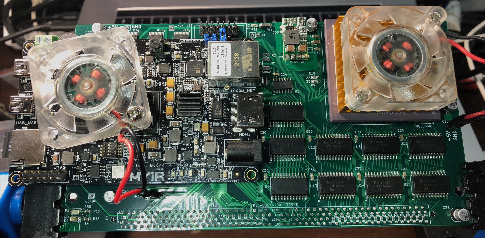

# Z3660 by sHaNsHe (Double H Tech)

 Z3660 is an Amiga 4000 CPU accelerator board based on A3660 and Z-turn FPGA board.
 
 Compared to A3660, Z3660 has some key differences:
 

 <b>1</b>. Z3660 accelerator board can only use 060 CPUs. This could be changed in the future, but at this time, only 060 is supported.
 
 <b>2</b>. If Z-turn FPGA board is <b>NOT</b> used, then you get a simple A3660. The only difference is that all A3660 PLDs are replaced by a XC95144XL-10TQ144 CPLD. It could be possible to use 060 up to 100MHz, but only 50 MHz and 64 MHz has been tested. A board with 128 MB of CPU RAM is in the works (to be connected at Z-turn sockets).
 
 <b>3</b>. If you <b>use a Z-turn FPGA board</b>, then you can add 128 MB of CPU RAM (DMA compatible), 256 MB of Z3 RAM (not DMA compatible), RTG 16bit, Ethernet, AHI and MHI. Also there is a SD to SCSI emulation for using raw RDB disk images (USB storage maybe in the future). And of course, you can use a 68060 rev6 at 100 MHz.
 

 <b>Main branch. Z3660 with Z-turn FPGA</b>
 
 This main branch has everything you need to build a Z3660 with Z-turn FPGA.
 If you want to build Z3660 without Z-turn FPGA, please go to wo_FPGA branch. The board is the same, but the CPLD firmware and BOM are obviously different.
 
 Current version of Schematics is v021. It has all fixes needed by v02 to have DMA compatibility (tested with ReA4091 as bus master), so you can build it.
 
 The exact model of Z-Turn board you will need is: MYS-7Z020-V2 ( mouser https://www.mouser.com/c/?q=MYS-7Z020-V2-0E1D-766-C-S ).
 
 
 v0.2 Z3660 without FPGA 

 
 
 v0.2 Z3660 with FPGA 

In this version you can see that I have used a 3V3 DCDC converter, instead of old linear regulator on VR1. Board has both footprints in one. Please be careful with its connection.
 
 Note on RTG status: RTG is full working now. It has all features that ZZ9000 has (except obviously scandoubler). Due limitations of Z-turn, output video is limited to 16 bit.
 Manufacturer ID was asigned to 5195 decimal, 0x144B hexadecimal (thanks to Olaf Barthel).
 All RTG, AHI and MHI are based on [ZZ9000 RTG](https://source.mnt.re/explore).
It has the same band-pass filters as the AX module, but made in software by one of the ARMs.
 
 <b>And finally, a checkmate move...</b>
 
 <i>Don't have a 060 rev6 CPU, and still want to try Z3660 with a Z-turn?</i>
 <i>sHaNsHe to the rescue!!! :P</i>
 
 One of the Z-turn ARM CPU can run the emulation code of a 68040 CPU with JIT that reaches up to 120 MIPS!!! It is based on Amiberry CPU code (for 32bit ARM). (And yes, I know, but Emu68 no longer supports 32 bit ARM).
 You can even switch between the real 060 CPU and the emulation by clicking on an app (and rebooting).
 
 <b>Discord channel link:</b>
  https://discord.gg/ua4u6SzyHf
 
 <b>Documents to read before using your Z3660</b> 
  You should read the "KNOWN_ISSUES.md" and "CHANGES.md" files to know the latest news.
  Thanks to ByteMavericks we have now the [wiki](https://github.com/shanshe/Z3660/wiki)
