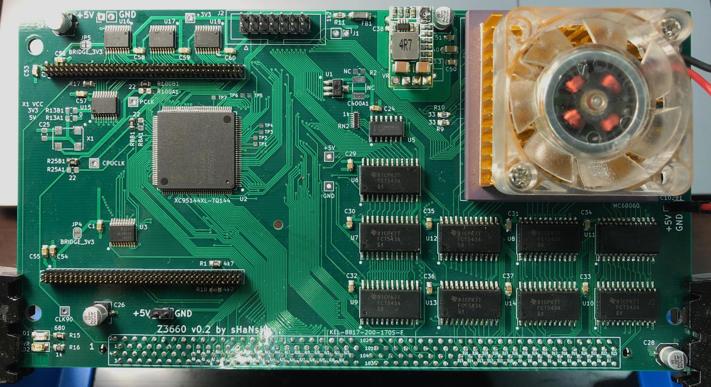

# Z3660 by shanshe

 Z3660 is an Amiga 4000 CPU accelerator board based on A3660 and Z-turn FPGA board.

 Z3660 has some differences compared to A3660:
 
 1. Z3660 accelerator board can only use 060 CPUs. This could be changed in the future, but at this time, only 060 is supported.
 
 2. If Z-turn FPGA is NOT used, then you get a simple A3660. The only difference is that all A3660 PLDs are replaced by a XC95144XL-TQ144 CPLD. It could be possible to use 060 up to 100MHz, but only 50 MHz and 64 MHz has been tested.
 
 3. If you use a Z-turn FPGA, then you can add 128 MB of CPU RAM, 256 MB of Z3 RAM, and RTG 16bit, (Ethernet, SCSI are planned, and AHI, USB maybe in the future) and you can use a 68060 up to 100 MHz.
 
 This wo_FPGA branch has everything you need to build a Z3660 without Z-turn FPGA.
 If you want to build Z3660 with Z-turn FPGA, please go to main branch. The board is the same, but the CPLD firmware and BOM are obviously different.
 
 Current version is Schematics v0.2. It has all fixes needed by v01, and now it is verified to work without any issues, so you can build it.
 
 v0.2 Z3660 without FPGA 

 Please note that this image is not exactly what it is needed to be solder: you will need to add an Oscillator on X1, you have to use 0 ohms on R8A1, R25A1, R100A1 instead of R8B1, R25B1, R100B1, and finally choose 0 ohms on R13A1 for 5V Oscillator (recommended), or R13B1 for 3V3 Oscillator.
 Also, in this version you can see that I have used a 3V3 DCDC converter, instead of old linear regulator on VR1. Board has both footprints in one. Please be careful with its connection.