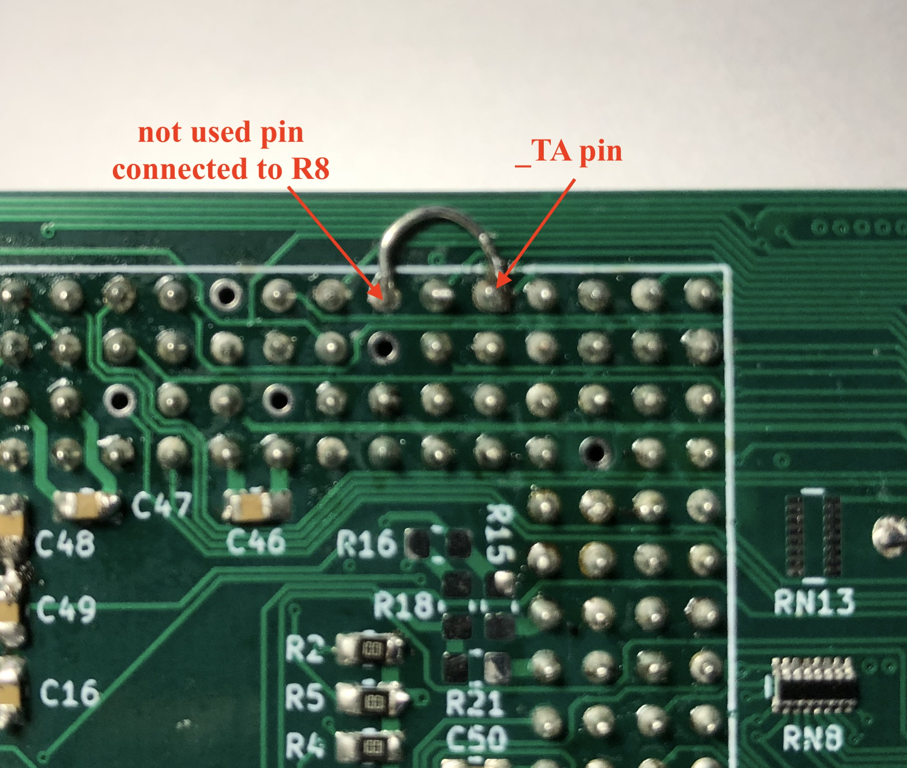

# Z3660 by shanshe

 Amiga 4000 CPU accelerator board based on A3660 and Z-turn FPGA board

 Z3660 has some differences compared to A3660:
 
 1. Z3660 accelerator board can only use 060 CPUs. This could be changed in the future, but at this time, only 060 is supported.
 
 2. If Z-turn FPGA is NOT used, then you get a simple A3660. The only difference is that all A3660 PLDs are replaced by a XC95144XL-TQ144 CPLD. It could be possible to use 060 up to 100MHz, but only 50 MHz has been tested.
 
 3. If you use a Z-turn FPGA, then you can add 128 MB of CPU RAM (more RAM, RTG, AHI, USB, SCSI are planned in the future) and you can use 060 up to 100 MHz.
 
 This wo_FPGA branch has everything you need to build a Z3660 without Z-turn FPGA.
 If you want to build Z3660 with Z-turn FPGA, please go to main branch. The board is the same, but the CPLD firmware and BOM are obviously different.
 
 Schematics v0.1 lists some necessary fixes. It will be updated very soon, and all that known issues will be fixed.
 Gerber v0.1 files also will be updated with all this fixes, please don't build them. They are here for my own reference.
 
 v0.1 Z3660 without FPGA 

 <h1 style="color:red;font-size:40px;">WARNING WIP WARNING</h1> 
This project is starting now, so please, take it easy and don't hype up so much...
 <h1 style="color:black;font-size:20px;">v0.1 BOARD FIXES</h1> 
 Fix #1. You will have to make a small brige between _TA pin and R8 by using a not used pin.
 

